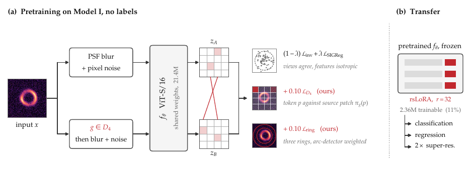

# Lens-LeJEPA

Code for **"The Einstein Radius Is Not an Augmentation: Geometry-Aware Pretraining for Dark Matter Substructure"**.

Lens-LeJEPA pretrains a Vision Transformer on unlabelled strong-lensing images with the teacher-free
[LeJEPA](https://arxiv.org/abs/2511.08544) objective plus two lensing priors, then freezes it and adapts it with
rank-stabilized LoRA to three downstream tasks: dark matter substructure classification, axion mass regression and
synthetic 2x super-resolution.



* **Lens-safe views.** Only PSF-like blur and detector noise. No crop, zoom or rescale, because they change the
  apparent Einstein radius (and `M(<θ_E) ∝ θ_E²`).
* **Prior 1: exact D4 patch correspondence.** A 90° rotation or mirror of a 160×160 image with 16×16 patches moves
  whole patches onto whole patches. Each token of the transformed view is matched to the token of the patch it came from.
* **Prior 2: arc-weighted ring consistency.** Tokens are pooled in three lens-centred rings, weighted by a label-free
  arc detector (image gradient + Laplacian). D4 maps each ring onto itself, so the descriptor must agree across views.

```
L = (1 - λ) L_inv + λ L_SIGReg + 0.10 L_D4 + 0.10 L_ring        (λ = 0.02)
```

Setting `method: lejepa` switches both priors off and gives the exact LeJEPA control used in the paper.

## Results

Held-out test sets, single seed, frozen ViT-S/16 encoder pretrained for 100 epochs on Model I only.

**Classification, Model II accuracy by labelled images per class**

| Encoder + adaptation | 100 | 500 | 1k | 5k | full | Model III full |
|---|---:|---:|---:|---:|---:|---:|
| LeJEPA + LoRA (no priors) | 0.366 | 0.625 | 0.733 | 0.869 | 0.926 | 0.922 |
| Lens-LeJEPA + LoRA | 0.476 | 0.693 | 0.780 | 0.881 | 0.942 | 0.945 |
| **Lens-LeJEPA + rsLoRA** | **0.482** | **0.719** | **0.797** | **0.899** | **0.977** | **0.974** |
| Lens-LeJEPA, full fine-tuning | 0.485 | 0.715 | 0.808 | 0.898 | 0.975 | 0.978 |

**Other tasks (full data)**

| | Regression MAE (dex) ↓ M-II / M-III | Synthetic 2x SR PSNR (dB) ↑ M-II / M-III |
|---|---:|---:|
| LeJEPA + LoRA | 0.121 / 0.122 | **48.32 / 45.38** |
| Lens-LeJEPA + LoRA | 0.149 / 0.109 | 44.70 / 42.50 |
| Lens-LeJEPA + rsLoRA | 0.100 / 0.090 | – |
| ResNet18, supervised | **0.021 / 0.019** | – |
| Bicubic / RCAN (same budget) | – | 41.07 / 40.27 · 19.49 / 19.01 |

The priors help classification most when labels are scarce and hurt reconstruction; see the paper's discussion.
Loading the original checkpoints into this code reproduces these held-out numbers exactly
(0.9768 accuracy, 0.1001 dex, 44.70 dB).

## Installation

```bash
git clone https://github.com/arnesh2212/Lens-FM-DeepLense.git lens-lejepa && cd lens-lejepa
pip install -e ".[dev]"          # or: pip install -r requirements.txt
pytest                           # 77 tests, CPU only, ~15 s
```

Python ≥ 3.10 and PyTorch ≥ 2.1. Everything runs on a single GPU; the paper used one RTX A4500 (20 GB).

## Data

The simulations are the public [ML4SCI DeepLense](https://github.com/ML4SCI/DeepLense) datasets, generated with
`lenstronomy`. Put them next to this repository (or pass `data_root=...`):

```
../datasets/
├── Model_I/{axion,cdm,no_sub}/*.npy          # 150x150, pretraining only (labels are never read)
├── Model_II/{axion,cdm,no_sub}/*.npy         # 64x64, Euclid-like
├── Model_II_test/{axion,cdm,no_sub}/*.npy
├── Model_III/{axion,cdm,no_sub}/*.npy        # 64x64, HST-like
└── Model_III_test/{axion,cdm,no_sub}/*.npy
```

Each `.npy` file holds one image. Axion files in Models II/III are object arrays `[image, mass_eV]`; the loader
handles plain arrays, wrapped object arrays and channel-first/last layouts. File lists are sorted, so splits are
identical on every machine.

| Dataset | Train images | Test images | Role |
|---|---:|---:|---|
| Model I | 87,525 | – | self-supervised pretraining |
| Model II | 89,104 | 15,000 | classification (few-shot + full), regression, SR |
| Model III | 89,396 | 15,000 | classification, regression, SR (full data) |

## Quick start

```bash
# 1. Pretrain (100 epochs, ~6 GPU-hours). Writes runs/pretrain/lens_lejepa/<run_name>/last_pretrain.pt
python -m lens_lejepa pretrain --config configs/pretrain/lens_lejepa.yaml
python -m lens_lejepa pretrain --config configs/pretrain/lejepa.yaml            # the no-prior control

# 2. Downstream tasks (frozen encoder + adapter; evaluates the best-validation checkpoint on the test set)
python -m lens_lejepa finetune --config configs/downstream/classification.yaml
python -m lens_lejepa finetune --config configs/downstream/classification.yaml --set shots=100
python -m lens_lejepa finetune --config configs/downstream/regression.yaml
python -m lens_lejepa finetune --config configs/downstream/super_resolution.yaml

# 3. Evaluate any downstream checkpoint on any test set
python -m lens_lejepa evaluate --checkpoint runs/classification/vit_small_rslora/Model_II_full_seed42/best.pt \
                               --test-root ../datasets/Model_II_test --output metrics.json

# Everything in the paper, then a results table
scripts/reproduce_paper.sh
python scripts/collect_results.py runs
```

Any config field can be overridden with `--set key=value` (values are parsed as YAML), for example
`--set shots=500 adaptation=dora device=cuda:1`, `--set objective.d4_weight=0.2` or
`--set adaptation=layerwise "rank_schedule=[8,16,32,64]"`. For a quick smoke test add
`epochs=1 max_steps_per_epoch=5`, and for pretraining also `collapse_patience=100`
(the collapse guard is meant for real runs and will reject an encoder trained for only a few steps).

## Tasks

`python -m lens_lejepa tasks` lists them.

| Task | Data | Head | Loss | Model selection | Test metrics |
|---|---|---|---|---|---|
| `classification` | axion / CDM / no substructure | linear on mean-pooled tokens | cross-entropy, label smoothing 0.1 | val. accuracy | accuracy, macro-F1, per-class and mean one-vs-rest AUROC |
| `regression` | axion images, `log10(m/eV)` | LayerNorm + linear | Huber on the standardised target | val. RMSE | MAE, RMSE (dex), R², Pearson r, MAE per mass decile |
| `super_resolution` | native 64×64 target, bicubic 32×32 input | token-to-patch decoder | Charbonnier + 0.1 (1 − SSIM) | val. PSNR | PSNR, SSIM, MAE, MSE |

**Splits.** Full data: stratified 80/20 train/validation split of the training folder. Few-shot (`shots=N`): `N`
training images per class and `N/4` validation images per class, drawn from the training folder only. Regression
uses a split stratified by mass decile, and `shots` counts axion images. The official `*_test` folders are used only
for the final evaluation of the selected checkpoint.

**Backbones and adaptation.** `backbone` is either a self-supervised encoder, which loads `pretrained` and is
adapted with `adaptation` (`lora`, `rslora`, `dora`, `loraplus`, `gated`, `loha`, `layerwise`, `full` or
`linear_probe`), or a baseline trained from scratch. At rank 32 on ViT-S/16, `lora`/`rslora` train 2.36M parameters
(48 adapted layers).

To add a task, see [docs/ADDING_A_TASK.md](docs/ADDING_A_TASK.md).

## Baselines

Every model in the paper's tables is implemented here. Parameter names match the original experiment code, and
loading the original checkpoints reproduces the reported held-out numbers.

| `backbone` | Type | Tasks | Paper Model II accuracy → this code |
|---|---|---|---|
| `resnet18` | supervised CNN | classification, regression | 0.9999 → 0.9999 |
| `vit` | supervised ViT (2 blocks, 1024-d) | classification | 0.9397 → 0.9397 |
| `vitsd` | supervised ViT with shifted patches + locality attention | classification | 0.8960 → 0.8960 |
| `lensiformer` | supervised physics-informed ViT (image + distortion map) | classification | 0.9820 → 0.9821 |
| `lenspinn` | supervised physics-informed CNN (image + distortion map) | classification, regression | 0.9997 → 0.9997 |
| `rcan` | supervised 2x super-resolution CNN | super-resolution | see note below |
| `bicubic` | interpolation | super-resolution | 41.07 dB → 41.07 dB |
| `vit_base_3blocks` | I-JEPA reference encoder (21.5M), `method: ijepa` | all (with adapters) | 0.9780 → 0.9780 (LoRA) |
| `lens_jepa` | Lens-JEPA reference encoder (2.45M), `method: lens_jepa`, `lens_jepa_sym`, `lens_jepa_focus` | all (with adapters) | 0.8298 → 0.8309, Sym 0.8660 → 0.8670 (LoRA) |

```bash
# supervised baselines
python -m lens_lejepa finetune --config configs/downstream/supervised.yaml --set backbone=lensiformer
python -m lens_lejepa finetune --config configs/downstream/supervised.yaml --set backbone=lenspinn task=regression weight_decay=0.01 label_smoothing=0.0

# reference encoders: masked latent prediction with an EMA teacher, 300 epochs
python -m lens_lejepa pretrain --config configs/pretrain/ijepa.yaml
python -m lens_lejepa pretrain --config configs/pretrain/lens_jepa_sym.yaml
python -m lens_lejepa finetune --config configs/downstream/classification.yaml \
    --set backbone=lens_jepa adaptation=lora pretrained=runs/pretrain/lens_jepa_sym/lens_jepa_sym_model_i_seed42/last_pretrain.pt
```

Lensiformer and the Lens-JEPA encoder invert the lens with scatter operations; when several pixels land on the same
source pixel the GPU result is not deterministic, so two evaluations of the *same* checkpoint differ on about 2% of
images. That is why these three rows differ from the paper by 0.1 points.

## Repository layout

```
lens_lejepa/
├── config.py            typed configs (defaults = paper settings), YAML + --set overrides
├── cli.py               python -m lens_lejepa {pretrain, finetune, evaluate, tasks}
├── metrics.py           classification / regression / super-resolution metrics
├── data/                io.py (npy loading, preprocessing), datasets.py, splits.py
├── models/              vit.py, lens_jepa.py, masking.py, heads.py, adapters.py, supervised.py, baselines.py
├── ssl/                 sigreg.py, views.py, lens_priors.py, objective.py, masked_jepa.py, diagnostics.py
├── tasks/               base.py (the Task interface), classification.py, regression.py, super_resolution.py
└── engine/              pretrain.py, finetune.py (training, model selection, evaluation)
configs/                 pretrain/*.yaml, downstream/*.yaml
scripts/                 reproduce_paper.sh, collect_results.py
tests/                   unit and end-to-end tests
```

## Reproducibility notes

* **Collapse guard.** Every pretraining epoch records pooled feature standard deviation and effective-rank fraction.
  Three consecutive epochs below `0.02` / `0.04` stop the run *before* a checkpoint is written, so a collapsed
  encoder can never reach a downstream task. Neither paper run triggered it.
* **Precision.** Training uses bfloat16 autocast; validation and test inference run in float32, so reported metrics
  do not depend on bf16 rounding.
* **Checkpoints.** Parameter names match the original experiment code, so the paper's pretraining checkpoints load with
  `strict=True` (`load_pretrained_encoder`). Downstream checkpoints store the model, the config and any task state (the
  regression target normaliser), so `evaluate` needs nothing else.
* **Super-resolution input.** Following the paper protocol, the encoder receives the upsampled low-resolution image in
  `[0, 1]`, not the per-image standardised input used in pretraining. This is what the reported numbers use.
* **Differences from the original research code**, none of which change a reported number: file lists are sorted
  (the original used directory order, so train/validation membership could differ between machines; test sets are
  unaffected), SSIM is averaged per image rather than per batch, attention uses
  `scaled_dot_product_attention` (outputs agree to ~1e-5), and multi-GPU SIGReg reduction was removed (single-GPU only).
* **RCAN.** An earlier version of the RCAN baseline ended in a sigmoid. On these mostly-black images it saturated
  within about ten steps, its gradient became exactly zero, and the network was stuck predicting a black image
  (19.5 dB). The output layer is now linear, as in the original RCAN, and predictions are clamped to `[0, 1]` at
  evaluation.

## Citation

```bibtex
@article{lenslejepa2026,
  title  = {The Einstein Radius Is Not an Augmentation: Geometry-Aware Pretraining for Dark Matter Substructure},
  year   = {2026},
  note   = {Under review}
}
```

## Acknowledgements

Developed during Google Summer of Code 2026 with [ML4SCI](https://ml4sci.org/) (DeepLense). The ViT follows the
I-JEPA reference implementation and SIGReg follows the official [LeJEPA](https://github.com/galilai-group/lejepa)
code.
